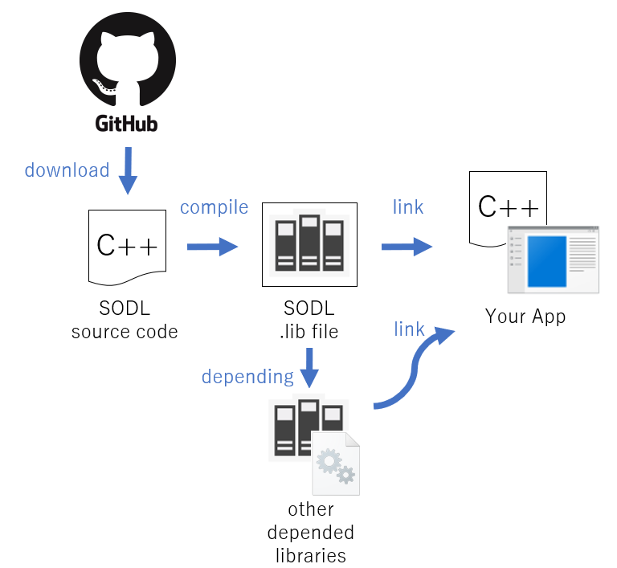
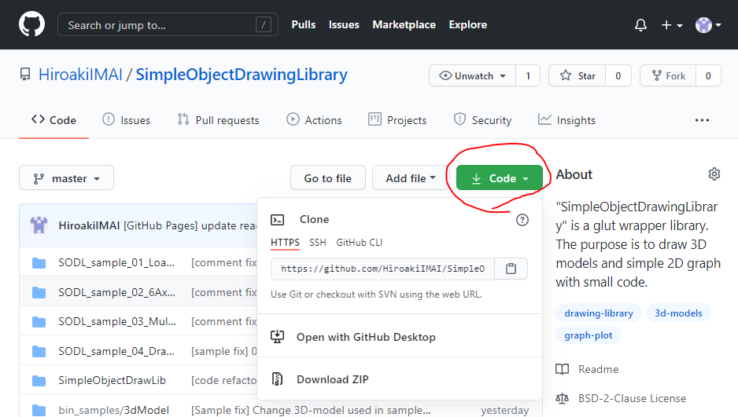
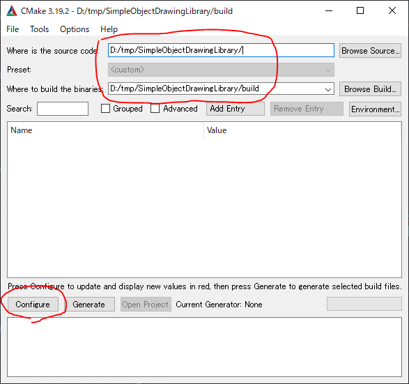
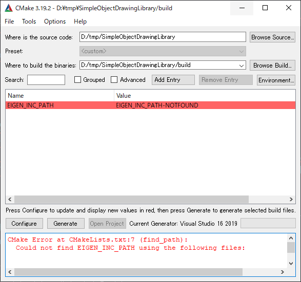
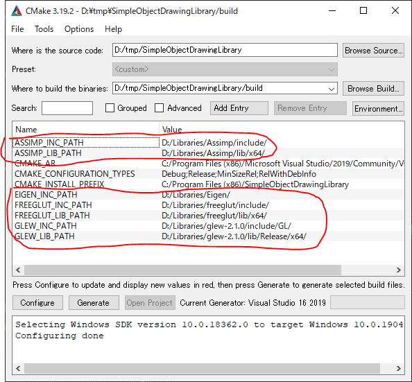
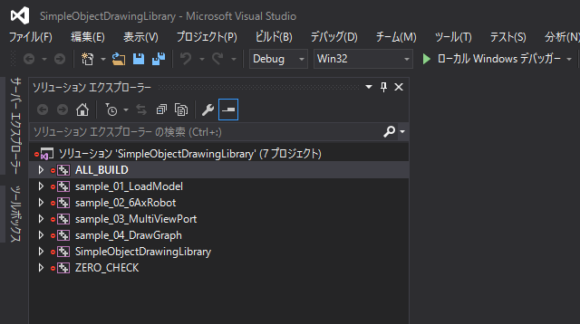

# SimpleObjectDrawingLibraryとサンプルプログラムのビルド手順

ここでは、SimpleObjectDrawingLibrary(以下、SODL)の使い方をサンプルプログラムのビルドを通して説明します。
(Windows環境を想定して説明します。)

以下に手順を示します。

1. [ダウンロード](#ダウンロード)
1. [依存ライブラリのインストール](#依存ライブラリのインストール)
1. [cmakeによるVisualStudioプロジェクトの作成](#cmakeによるVisualStudioプロジェクトの作成)
1. [プロジェクトのビルド](#プロジェクトのビルド)

## ダウンロード
次のGitHubのリポジトリトップにアクセスしてgit clone や zip でダウンロードしてください。
https://github.com/HiroakiIMAI/SimpleObjectDrawingLibrary

## 依存ライブラリのインストール
下記4つのライブラリをインストールしてください。
インストール作業の詳細は[こちらのページ](InstallDependency.md)を参照して下さい。
一般的なインストール方法を説明しているだけなので、このような作業に慣れている方は
読み飛ばして頂いて構いません。

### fleeglut
http://freeglut.sourceforge.net/index.php#download

### glew
http://glew.sourceforge.net/

### Eigen
http://eigen.tuxfamily.org/index.php?title=Main_Page

### Assimp
http://assimp.org/index.php/downloads

## cmakeによるVisualStudioプロジェクトの作成
以下では、 D:\tmp の下に SODL のソースコードを置いた場合の例を示します。
cmakeを起動して下記のようにパスを指定します。

Configure を押すと、include, lib のパスが見つからないというエラーが出ますので
手動で指定して再度Configureを実施してください。
一通りパスの設定が終わるまで、Configureと手動指定を繰り返します。

図の例では、 D:\Libraries 以下に各種ライブラリのlibとincludeを置いていますが、
各自のインストールした環境に合わせて設定してください。

一通りパスの指定が終わってエラーが取れてから Generate を押すと
VisualStrudioのソリューション(.sln)が D:\tmp\SimpleObjectDrawingLibrary\build の中に出来上がります。

## プロジェクトのビルド
ソリューションを開くと複数のプロジェクトが生成されています。
"SimpleObjectDrawingLibrary"がライブラリの本体をビルドするためのプロジェクトです。
右クリックメニューからビルドすると、 D:\tmp\SimpleObjectDrawingLibrary\build\SimpleObjectDrawLib\
Debug または Release に SimpleObjectDrawingLibrary.lib が生成されます。

"ALL_BUILD"をビルドするとサンプルを含めた全てのプロジェクトをまとめてビルドできます。
サンプルプログラムをビルドすると、D:\tmp\SimpleObjectDrawingLibrary\bin_samples の中に
.exe ファイルが作成されます。

## サンプルプログラムの実行
出来上がった.exeを実行したときに"XXX.dllが見つからないため、コードの実行を続行できません。プログラムを再インストールすると、この問題が解決する可能性があります。" というエラーが出る場合、依存ライブラリへのパスが通っていません。[依存ライブラリのインストール](#依存ライブラリのインストール) で入手したライブラリから下記.dllをコピーして.exeファイルの同フォルダにコピペするか、dllのある場所にパスを通して下さい。

- assimp-XXX.dll　(XXXはバージョン番号など)
- freeglut.dll
- glew32.dll
