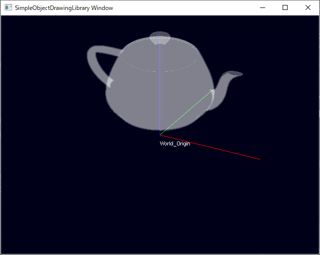

# ライブラリ機能とサンプルプログラムの説明

このページでは、下記サンプルの説明を通して　SimpleObjectDrawingLibrary (以下、SODL) の機能を説明します。

- [sample_01_LoadModel](#sample_01_LoadModel)


## sample_01_LoadModel
### サンプルの動作説明
このサンプルは、3Dモデルのロードして表示します。
本ライブラリにおける Hello World のようなものです。

- exeを実行した時点で、コンソールWindowとOpenGLのグラフィックウィンドウが立ち上がります。
- 3Dモデル "teapot.obj" をグラフィック画面に表示します。
- 描画している空間の原点 World_Origin を表す座標系シンボル(RGBがXYZに対応する直行する直線の形状)を表示します

#### 機能：モデル表示
- 表示可能な3Dモデルの種類(拡張子)はassimpのサポート範囲に準じます
- 現時点でマテリアルの読み込みには対応出来ていません。
  半透明の白で一律に塗られます。


#### 機能：グラフィック画面のデフォルトUI操作
- マウスドラッグによる視点回転
- ホイール操作による視野の拡大縮小
- 現時点で、視点中心の移動はデフォルトでは提供されません。
  (必要ならユーザコードで実装して下さい。)



### サンプルコードの解説
サンプルコードは主に下記のような構成を持ちます
1. 初期化処理
2. メインループ

コメントを削除すればたったこれだけのコードです。
```
int main(int argc, char ** argv)
{
	sodl::DrawingManager::initMngr( &argc, argv, app::WINDOW_SIZE_X, app::WINDOW_SIZE_Y);

	{
		auto World_Origin = sodl::CoordChainObj::create("World_Origin");

		std::string exePath = app::GetModulePath();
		auto model_Crd = sodl::CoordChain3dMdl::create(exePath + "3dModel\\teapot\\teapot.obj", "model_Crd", World_Origin);
		model_Crd->CrdTrs.translation() = Eigen::Vector3f(0.f, 0.f, 20.f);
		model_Crd->CrdTrs.linear() = Eigen::AngleAxisf(M_PI / 2.f, UnitX).matrix();

		sodl::drwMngr->AddObjTree_ToDrwSpace(World_Origin);
	}

	while(1)
	{
		sodl::drwMngr->drawUpdt();
		Sleep(10);
	}
	return 0;
}
```

コード全体は[こちらを参照](https://github.com/HiroakiIMAI/SimpleObjectDrawingLibrary/blob/master/SODL_sample_01_LoadModel/SODL_sample_01_LoadModel_main.cpp)

#### 1. 初期化処理

##### 1.1. ライブラリの初期化
ユーザコードに必要なお決まりの処理として、ライブラリの初期化があります。
```
int main(int argc, char ** argv)
{
	//-----------------------------------------------------
	// ライブラリの描画マネージャを初期化する
	//-----------------------------------------------------
	// この時点でライブラリによってOpenGLコンテキストが作成され、
	// OpenGLのウィンドウが表示される
	sodl::DrawingManager::initMngr( &argc, argv, app::WINDOW_SIZE_X, app::WINDOW_SIZE_Y);

```
コメントを見て頂ければ十分ですが、ここではおまけの補足情報を記載します。

SODLのヘッダをインクルードした時点で、ライブラリの名前空間 SmplObjDrwLib:: の中に、空のポインタ変数 drwMngr が生成されています。
sodl::DrawingManager::initMngr()による初期化を実施すると、drwMngr にインスタンスが代入されます。drwMngr は DrawingManager 型のオブジェクトです。このオブジェクトは、ライブラリの機能を実現するた際にグローバル変数的に保持したい情報をメンバ変数として保持しています。

##### 1.2. 描画対象オブジェクトをcreateし、描画マネージャの描画空間にセットする
```
//-----------------------------------------------------
// ワールド座標系原点を定義
//-----------------------------------------------------
// ワールド座標系原点を表すシンボル表示用のオブジェクトを生成する
auto World_Origin = sodl::CoordChainObj::create("World_Origin");

(~~~中略~~~)

//-----------------------------------------------------
// 生成したオブジェクトを描画対象として描画マネージャに登録
//-----------------------------------------------------
// 定義した座標系連鎖を描画マネージャの持つ描画空間にセット
sodl::drwMngr->AddObjTree_ToDrwSpace(World_Origin);

```
このコードの前半部分で、World_Origin を表す座標系シンボルを描画オブジェクトとして生成しています。
中略をはさんで、これを描画対象として描画マネージャ(ライブラリ初期化でインスタンスを得たdrwMngr)に登録しています。

この2つの処理は、SODLの使い方を理解する上で重要です。SODLを用いて何かをグラフィック画面に表示したい場合、
①描画対象を描画可能オブジェクトとして生成し、②生成したオブジェクトを描画マネージャに登録する、というのが定型的な手順になります。

[補足]
中略部分を削除しても、座標系シンボルを表示するサンプルプログラムとして、本プログラムは成立します。

##### 1.3. 3Dモデルのロードと描画可能オブジェクト化
 ```
 //-----------------------------------------------------
 // 3Dモデルオブジェクトを生成し、座標系オブジェクトにアタッチする
 //-----------------------------------------------------
 // 実行ファイルのパスを取得する(モデルファイルの位置を相対パスで指定するため)
 std::string exePath = app::GetModulePath();

 // 3Dモデル描画付き座標系オブジェクトを生成し、親座標系としてワールド座標系を指定する。
 auto model_Crd = sodl::CoordChain3dMdl::create(exePath + "3dModel\\teapot\\teapot.obj", "model_Crd", World_Origin);

(後略)
 ```
1.2. で中略とされたコードです。
sodl::CoordChain3dMdl::create() が、3Dモデルをファイルシステムから読み出して、描画可能オブジェクトとしてインスタンス化してくれます。以降はモデルの位置と姿勢の調整ですので後略としています。

ここで生成した、 model_Crd は後続のコードで描画マネージャに明示的に登録していないことに注目してください。これは、model_Crd の create() 時に第3引数を用いて World_Origin を親座標系として指定していることと関係があります。1.3. の最後に描画マネージャにオブジェクトを登録した関数の名称はAddObjTree_ToDrwSpace()です。この ObjTree が指している対象は、引数で渡した描画可能オブジェクトと、その子オブジェクト、孫オブジェクト・・・と連なる一連の描画可能オブジェクト群です。このため、新たに追加した描画可能オブジェクトがWorld_Originの子である限り、AddObjTree_ToDrwSpace()を繰り返し呼ぶ必要がありません。

座標系の親子関係は、他にもっと重要な意味を持ちますが、それについては sample_02_6AxRobot で説明します。

#### 2. メインループ
```
while(1)
{
  //-----------------------------------------------------
  // 描画マネージャから描画更新を実行する
  //-----------------------------------------------------
  sodl::drwMngr->drawUpdt();

  Sleep(10);
}
```
描画マネージャのインスタンスのdrawUpdt()をコールすることで、グラフィックウィンドウの描画を更新します。
グラフィックウィンドウのデフォルトのUI機能として、マウス入力等に応じて視点方向を変える機能が提供されていますが、これを有効に動作させる為には、周期的にdrawUpdt()をコールする必要があります。

以上が sample_01_LoadModel の説明になります。

これまでの説明をふまえると、SODLとそれを利用するユーザコードの関係を次のように説明できます。
- SODLは、ライブラリの初期化時に、描画マネージャのインスタンスを提供する。
- SODLは、描画可能オブジェクトの雛形となるクラス型を提供する。
- ユーザコードは、描画可能オブジェクトをインスタンス化し、描画マネージャに登録し、描画更新をコールすることで所望のグラフィック表示を実現する。


## sample_02_6AxRobot
(準備中)

## sample_03_MultiViewPort
(準備中)

## sample_04_DrawGraph
(準備中)

[トップページへ戻る](README.md)
