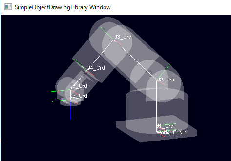
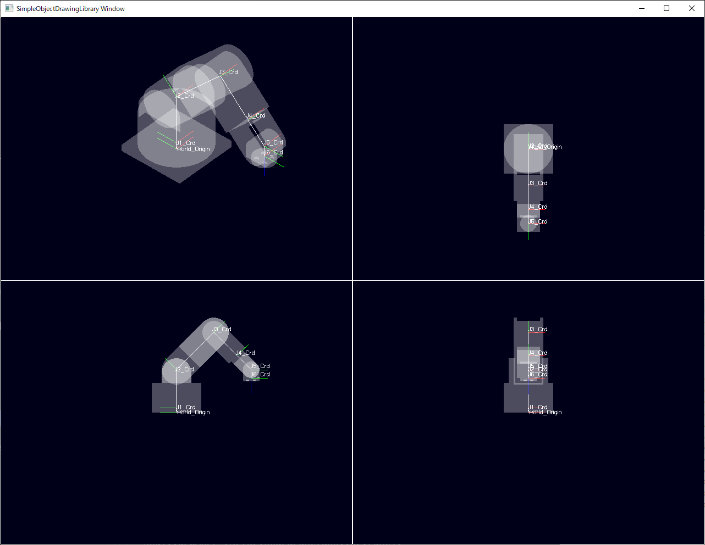

# ライブラリ機能とサンプルプログラムの説明

このページでは、下記サンプルの説明を通して　SimpleObjectDrawingLibrary (以下、SODL) の機能を説明します。

- [sample_01_LoadModel](#sample_01_LoadModel)
- [sample_02_6AxRobot](#sample_02_6AxRobot)
- [sample_03_MultiViewPort](#sample_03_MultiViewPort)
- [sample_04_DrawGraph](#sample_04_DrawGraph)

## sample_01_LoadModel
### サンプルの動作説明
このサンプルは、3Dモデルのロードして表示します。
本ライブラリにおける Hello World のようなものです。

- exeを実行した時点で、コンソールWindowとOpenGLのグラフィックウィンドウが立ち上がります。
- 3Dモデル "teapot.obj" をグラフィック画面に表示します。
- 描画している空間の原点 World_Origin を表す座標系シンボル(RGBがXYZに対応する直行する直線の形状)を表示します

#### 機能：モデル表示
- 表示可能な3Dモデルの種類(拡張子)はassimpのサポート範囲に準じます
- 現時点でマテリアルの読み込みには対応出来ていません。
  半透明の白で一律に塗られます。


#### 機能：グラフィック画面のデフォルトUI操作
- マウスドラッグによる視点回転
- ホイール操作による視野の拡大縮小
- 現時点で、視点中心の移動はデフォルトでは提供されません。
  (必要ならユーザコードで実装して下さい。)


### サンプルコードの解説
サンプルコードは主に下記のような構成を持ちます
1. 初期化処理
2. メインループ

コメントを削除すればたったこれだけのコードです。
```
int main(int argc, char ** argv)
{
	sodl::DrawingManager::initMngr( &argc, argv, app::WINDOW_SIZE_X, app::WINDOW_SIZE_Y);

	{
		auto World_Origin = sodl::CoordChainObj::create("World_Origin");

		std::string exePath = app::GetModulePath();
		auto model_Crd = sodl::CoordChain3dMdl::create(exePath + "3dModel\\teapot\\teapot.obj", "model_Crd", World_Origin);
		model_Crd->CrdTrs.translation() = Eigen::Vector3f(0.f, 0.f, 20.f);
		model_Crd->CrdTrs.linear() = Eigen::AngleAxisf(M_PI / 2.f, UnitX).matrix();

		sodl::drwMngr->AddObjTree_ToDrwSpace(World_Origin);
	}

	while(1)
	{
		sodl::drwMngr->drawUpdt();
		Sleep(10);
	}
	return 0;
}
```

コード全体は[こちらを参照](https://github.com/HiroakiIMAI/SimpleObjectDrawingLibrary/blob/master/SODL_sample_01_LoadModel/SODL_sample_01_LoadModel_main.cpp)

#### 1. 初期化処理

##### 1.1. ライブラリの初期化
ユーザコードに必要なお決まりの処理として、ライブラリの初期化があります。
```
int main(int argc, char ** argv)
{
	//-----------------------------------------------------
	// ライブラリの描画マネージャを初期化する
	//-----------------------------------------------------
	// この時点でライブラリによってOpenGLコンテキストが作成され、
	// OpenGLのウィンドウが表示される
	sodl::DrawingManager::initMngr( &argc, argv, app::WINDOW_SIZE_X, app::WINDOW_SIZE_Y);

```
コメントを見て頂ければ十分ですが、ここではおまけの補足情報を記載します。

SODLのヘッダをインクルードした時点で、ライブラリの名前空間 SmplObjDrwLib:: の中に、空のポインタ変数 drwMngr が生成されています。
sodl::DrawingManager::initMngr()による初期化を実施すると、drwMngr にインスタンスが代入されます。drwMngr は DrawingManager 型のオブジェクトです。このオブジェクトは、ライブラリの機能を実現するた際にグローバル変数的に保持したい情報をメンバ変数として保持しています。

##### 1.2. 描画対象オブジェクトをcreateし、描画マネージャの描画空間にセットする
```
//-----------------------------------------------------
// ワールド座標系原点を定義
//-----------------------------------------------------
// ワールド座標系原点を表すシンボル表示用のオブジェクトを生成する
auto World_Origin = sodl::CoordChainObj::create("World_Origin");

(~~~中略~~~)

//-----------------------------------------------------
// 生成したオブジェクトを描画対象として描画マネージャに登録
//-----------------------------------------------------
// 定義した座標系連鎖を描画マネージャの持つ描画空間にセット
sodl::drwMngr->AddObjTree_ToDrwSpace(World_Origin);

```
このコードの前半部分で、World_Origin を表す座標系シンボルを描画オブジェクトとして生成しています。
中略をはさんで、これを描画対象として描画マネージャ(ライブラリ初期化でインスタンスを得たdrwMngr)に登録しています。

この2つの処理は、SODLの使い方を理解する上で重要です。SODLを用いて何かをグラフィック画面に表示したい場合、
①描画対象を描画可能オブジェクトとして生成し、②生成したオブジェクトを描画マネージャに登録する、というのが定型的な手順になります。

[補足]
中略部分を削除しても、座標系シンボルを表示するサンプルプログラムとして、本プログラムは成立します。

##### 1.3. 3Dモデルのロードと描画可能オブジェクト化
 ```
 //-----------------------------------------------------
 // 3Dモデルオブジェクトを生成し、座標系オブジェクトにアタッチする
 //-----------------------------------------------------
 // 実行ファイルのパスを取得する(モデルファイルの位置を相対パスで指定するため)
 std::string exePath = app::GetModulePath();

 // 3Dモデル描画付き座標系オブジェクトを生成し、親座標系としてワールド座標系を指定する。
 auto model_Crd = sodl::CoordChain3dMdl::create(exePath + "3dModel\\teapot\\teapot.obj", "model_Crd", World_Origin);

(後略)
 ```
1.2. で中略とされたコードです。
sodl::CoordChain3dMdl::create() が、3Dモデルをファイルシステムから読み出して、描画可能オブジェクトとしてインスタンス化してくれます。以降はモデルの位置と姿勢の調整ですので後略としています。

ここで生成した、 model_Crd は後続のコードで描画マネージャに明示的に登録していないことに注目してください。これは、model_Crd の create() 時に第3引数を用いて World_Origin を親座標系として指定していることと関係があります。1.3. の最後に描画マネージャにオブジェクトを登録した関数の名称はAddObjTree_ToDrwSpace()です。この ObjTree が指している対象は、引数で渡した描画可能オブジェクトと、その子オブジェクト、孫オブジェクト・・・と連なる一連の描画可能オブジェクト群です。このため、新たに追加した描画可能オブジェクトがWorld_Originの子である限り、AddObjTree_ToDrwSpace()を繰り返し呼ぶ必要がありません。

座標系の親子関係は、他にもっと重要な意味を持ちますが、それについては sample_02_6AxRobot で説明します。

#### 2. メインループ
```
while(1)
{
  //-----------------------------------------------------
  // 描画マネージャから描画更新を実行する
  //-----------------------------------------------------
  sodl::drwMngr->drawUpdt();

  Sleep(10);
}
```
描画マネージャのインスタンスのdrawUpdt()をコールすることで、グラフィックウィンドウの描画を更新します。
グラフィックウィンドウのデフォルトのUI機能として、マウス入力等に応じて視点方向を変える機能が提供されていますが、これを有効に動作させる為には、周期的にdrawUpdt()をコールする必要があります。

以上が sample_01_LoadModel の説明になります。

これまでの説明をふまえると、SODLとそれを利用するユーザコードの役割を次のように説明できます。
- SODLは、ライブラリの初期化時に、描画マネージャのインスタンスを提供します。
- SODLは、描画可能オブジェクトの雛形となるクラス型を提供します。
- ユーザコードは、描画可能オブジェクトをインスタンス化し、描画マネージャに登録し、描画更新をコールすることで所望のグラフィック表示を実現します。


## sample_02_6AxRobot


### サンプルの動作説明
このサンプルは、6軸垂直多関節ロボットを模したモデルを表示し、
その各関節のモータ角度をキー入力で制御します。
キーボードの"1"\~"6"キーを押すとロボットの根本から先端の各関節角度が+方向に
"q"\~"y"キーを押すと、-方向に回転します。

#### 機能：座標系連鎖
SODLは、描画可能オブジェクト間の親子関係を定義する事ができます。
このとき、子オブジェクトの座標は、親オブジェクトの持つ座標系原点からの相対的な位置として保持されます。
そして、親オブジェクトの位置姿勢が変化した場合、ワールド座標系原点から見た子オブジェクトの位置姿勢は、
親座標系にくっついて移動しているかのように振る舞います。このような座標系同士の関係を"座標系連鎖"と呼びます。
SODLは、オブジェクトの親子関係を定義するだけで、自動的に座標系を連鎖させます。

#### 機能：ユーザ定義コールバック(キーボード)
SODLでは、glutに用意されているUI用のコールバック関数に相当するコールバック関数を使用できる。
具体的には、ユーザコード側で定義したコールバック関数をSODLの提供する描画マネージャに
関数ポインタとして渡す事で、ユーザ定義のマウスやキーボード入力に対するコールバック処理を実現できる。
本サンプルではキーボードコールバックを実装している。

### サンプルコードの解説
サンプルコードの主な構成は、[sample_01_LoadModel](#sample_01_LoadModel)と同様です。
ここでは主に、[sample_01_LoadModel](#sample_01_LoadModel)と差分にあたる部分を説明します。

コード全体は[こちらを参照](https://github.com/HiroakiIMAI/SimpleObjectDrawingLibrary/blob/master/SODL_sample_02_6AxRobot/SODL_sample_02_6AxRobot_main.cpp)

#### 1. 初期化処理

##### 1.1. 連鎖座標系の定義
```
//-----------------------------------------------------
// ワールド座標系原点から連鎖するJ1~6座標系オブジェクトを定義
//   J1~6座標系が6軸ロボットアームの各関節の位置姿勢を表現する
//-----------------------------------------------------
// ワールド座標原点を定義
auto World_Origin = sodl::CoordChainObj::create("World_Origin");
World_Origin->CrdTrs.translation() = Eigen::Vector3f(0.f, 0.f,0.f);

// J1(Joint1)座標系オブジェクトを作成、ワールド座標系にアタッチする
auto J1_Crd = sodl::CoordChainObj::create("J1_Crd", World_Origin);
// J1座標系の親座標系に対するオフセット量を設定する
J1_Crd->CrdTrs.translation() = Eigen::Vector3f(0.f, 0.f, 30.f);

// J2座標系オブジェクトを作成、親(J1)座標系にアタッチする
auto J2_Crd = sodl::CoordChainObj::create("J2_Crd", J1_Crd );
// J2座標系の親座標系に対するオフセット量を設定する
J2_Crd->CrdTrs.translation() = Eigen::Vector3f(0.f, 0.f, 230.f);

(中略)

// J6座標系オブジェクトを作成
auto J6_Crd = sodl::CoordChainObj::create("J6_Crd", J5_Crd);
// J6座標系の親座標系に対するオフセット量を設定する
J6_Crd->CrdTrs.translation() = Eigen::Vector3f(0.f, 0.f, 50.f);

```
[sample_01_LoadModel](#sample_01_LoadModel)では1つの座標系しか定義しませんでしたが、
このサンプルではWorldOriginの他にJ1\~J6の6つの座標系を定義しています。
("J"は"Joint"(関節)に由来します。)
これらの座標系の原点が、6軸ロボットアームの各関節の回転中心の位置を表現します。
座標系の向きは、その関節の先に接続されたリンクがどのような姿勢を取るかを表現します。

垂直多関節の6軸ロボットアームは、関節とリンクが直鎖状に接続された機械構造を持ちます。
定義した座標系に直鎖状の親子関係を与えて、座標系連鎖全体でロボットアームを表現しています。

J1\~J6の座標系オブジェクトをそれぞれ定義した直後に下記のような処理があります。
```
J1_Crd->CrdTrs.translation() = Eigen::Vector3f(0.f, 0.f, 30.f);
```
これは、１つ根本側の関節から、オブジェクト自身が表す関節までのリンク長を設定するコードです。
座標系オブジェクトの```CrdTrs```というメンバはEigen::Affine3f型[*1][Eigen]のオブジェクトで、
親座標系から自身までの座標変換を表現します。
メソッド``` translation() ```は、座標変換行列の併進成分(x,y,z移動量)への参照を返すので、
そこにリンク長を表現する(x,y,z移動量)をEigen::Vector3f型[*1][Eigen]のオブジェクトとして代入しています。

[Eigen]:(#*1Affine3f,Vector3fその他Eigen定義型について)
##### *1 Affine3f, Vector3f その他Eigen定義型について
Affine3fはSODLが依存する行列計算ライブラリEigenで定義された、座標変換行列を表現するクラス型です。
座標変換行列とEigen::Affine3fクラスの説明はここでは割愛します。
[Eigenの公式サイトのTransformの説明](http://eigen.tuxfamily.org/dox/classEigen_1_1Transform.html)を参照してください。AffineはTransformの4行目を定数[0,0,0,1]で固定化した特殊ケースです。

このように、SODLでは座標変換や座標系、座標値の扱いにEigenライブラリのオブジェクトを
ユーザコードに隠蔽せずに使用します。
よって、Eigenの扱いについてはある程度慣れる必要があります。
(とても有名で便利なライブラリなので、使い慣れておく価値は十分にあります。)

##### 1.2. ロボットの各リンクのモデルロードして各座標系にアタッチ
```
//-----------------------------------------------------
// 3Dモデル描画用のオブジェクトを作成する
//   6軸ロボットアームの各関節を表現する各座標系に
//   ロボットアームの各リンクの3Dモデルをアタッチする。
//-----------------------------------------------------
std::string exePath = app::GetModulePath();

// ロボット台座のモデルをロードした描画オブジェクトを生成し、ワールド座標系原点にアタッチする
auto RobotBase = sodl::CoordChain3dMdl::create(exePath + "\\3dModel\\SimpleRobot6Ax\\BasePlate.stl", "RobotBase", World_Origin);

// S1(sholder1)のモデルをロードした描画オブジェクトを生成し、J1座標系にアタッチする
auto RobotSholder1 = sodl::CoordChain3dMdl::create(exePath + "\\3dModel\\SimpleRobot6Ax\\S1.stl", "S1", J1_Crd);

// S2のモデルをロードした描画オブジェクトを生成し、J2座標系にアタッチする
auto RobotSholder2 = sodl::CoordChain3dMdl::create(exePath + "\\3dModel\\SimpleRobot6Ax\\S2.stl", "S2", J2_Crd);
// S2モデルの表示位置を調整するために、親(J2)座標系に対する座標系オフセットを設定する
RobotSholder2->CrdTrs.translation() = Eigen::Vector3f(0.f, 0.f, -90.f);

(以下略)

```
このコードは、ロボットアームの各リンクの3Dモデルを[1.1.連鎖座標系の定義](#1.1.連鎖座標系の定義)で定義したJ1\~J6座標系に貼り付けることで、関節の回転角度に応じて姿勢を変えるロボットの3Dモデルを表現しています。
モデルのロードは [sample_01_LoadModel](#sample_01_LoadModel) と特に変わりません。
各リンクの親となる座標系オブジェクトを親として指定しています。

ここでは以下の部分に注目します。
```
// S2モデルの表示位置を調整するために、親(J2)座標系に対する座標系オフセットを設定する
RobotSholder2->CrdTrs.translation() = Eigen::Vector3f(0.f, 0.f, -90.f);
```
モデリング時の3Dモデルの座標系原点から90[mm]オフセットした位置に、関節の回転中心がある3Dモデルを扱っているので、
その回転中心と座標系オブジェクトの原点(=座標系連鎖で表現したロボットモデルの関節位置)が一致するように
-90[mm]分のオフセットを与えて調整しています。

コードの実装は、 [1.1. 連鎖座標系の定義](#1.1.連鎖座標系の定義) で説明した座標系オブジェクトと同様に、
親座標系からオブジェクト自身までの座標変換(=親座標系から見た自身の位置)を設定しています。
```RobotSholder2```はロードした3Dモデルを収めた```CoordChain3dMdl型```のオブジェクトですが、
座標系オブジェクト```CoordChainObj```と同様に扱う事ができます。
なぜなら、本ライブラリにおいて、親子関係を持つ描画可能なオブジェクトは、
基本的に```CoordChainObj```から派生したクラスだからです。

#### 2. メインループ
##### 2.1. 各関節角度の更新

```
while(1)
{
  //-----------------------------------------------------
  // キー入力で更新される変数値によって、描画オブジェクトの座標変換行列を更新する
  //-----------------------------------------------------
  J1_Crd->CrdTrs.linear() = Eigen::AngleAxisf(app::ax_J1, UnitZ).matrix();
  J2_Crd->CrdTrs.linear() = Eigen::AngleAxisf(app::ax_J2, UnitX).matrix();
  J3_Crd->CrdTrs.linear() = Eigen::AngleAxisf(app::ax_J3, UnitX).matrix();
  J4_Crd->CrdTrs.linear() = Eigen::AngleAxisf(app::ax_J4, UnitZ).matrix();
  J5_Crd->CrdTrs.linear() = Eigen::AngleAxisf(app::ax_J5, UnitX).matrix();
  J6_Crd->CrdTrs.linear() = Eigen::AngleAxisf(app::ax_J6, UnitZ).matrix();

  //-----------------------------------------------------
  // 描画マネージャから描画更新を実行する
  //-----------------------------------------------------
  sodl::drwMngr->drawUpdt();

  Sleep(10);
}
```
[sample_01_LoadModel](#sample_01_LoadModel)では動かないモデルを表示するだけだったので、
```sodl::drwMngr->drawUpdt();``` をコールするのみでしたが、
このサンプルでは描画を更新する度にロボットの関節角度の変化を描画に反映するための処理がメインループに入ってきます。

まず、更新処理の左辺値に注目します。
左辺には初期化処理で作成した```J1_Crd```などが再登場します。
ここで```J1_Crd```のメンバの値を変更すると、その変更が次の描画更新に自動的に反映されます。
なぜなら、```J1_Crd```はスマートポインタに収められたインスタンスであり、
描画マネージャは同じインスタンスを指すスマートポインタを得ているからです。
描画マネージャが描画対象のインスタンスへのスマートポインタを得るのは、
初期化処理の中で```sodl::drwMngr->AddObjTree_ToDrwSpace();```をコールされたときです。

左辺の更新されているメンバは```CrdTrs.linear()```です。
CrdTrsはEigen::Affin3f型の座標変換行列を表すオブジェクトで、linear()は座標変換行列の中の回転行列部分への参照を返します。よってこの式では、親座標系から見た```J1_Crd```の回転角度を更新していることになります。

次に右辺値に注目しましょう。
これは純粋なEigenライブラリのコードです。
AngleAxis()は第一引数の角度だけ、第二引数で指定した軸回りに回転させる、
3次元空間上の回転を表現するオブジェクトを返します。そのオブジェクトの.matrix()にアクセスして、
これを回転行列として表現したオブジェクトを得て、左辺に代入しています。

ここで回転角度として与えられている```app::ax_J1```には、次で説明するコールバック関数によって
ユーザキー入力を反映した値が格納されています。

#### 3. コールバック関数の定義
```
namespace app {
	//================================================================
	//
	//	<Summary>		キー操作時のコールバック
	//	<Description>
	//================================================================
	void keyFunc(unsigned char key, int u, int v)
	{
		const float		KEY_MOT_UNIT	=	5.f;
		const float		CNV_DEG2RAD		=	(M_PI / 180.f);

		switch (key) {

		case '1':
			ax_J1 += KEY_MOT_UNIT * CNV_DEG2RAD;
			break;

		case '2':
			ax_J2 += KEY_MOT_UNIT * CNV_DEG2RAD;
			break;

    (以下略)

		}
	}
```
このサンプルでは、押されたキーに応じてロボットの関節角度を表すグローバル変数```ax_J1```などを5度ずつ増減させています。
openGLで用意されているキーボードコールバックと同じ仕様の引数でコールバック関数を定義してください。


```
// ライブラリの描画マネージャを初期化する
sodl::DrawingManager::initMngr( &argc, argv, app::WINDOW_SIZE_X, app::WINDOW_SIZE_Y);

// 描画マネージャにコールバック関数を設定する
sodl::drwMngr->SetKeyboardFunc(app::keyFunc);

```

定義したコールバック関数は、描画マネージャの初期化後に、描画マネージャにSetKeySetKeyboardFunc()によって登録して下さい。
受け取った関数ポインタをライブラリ内部でopenGLの提供するコールバック登録処理にそのまま渡しています。

以上が、sample_02_6AxRobot の説明になります。

## sample_03_MultiViewPort


### サンプルの動作説明
このサンプルでは、[sample_02_6AxRobot](#sample_02_6AxRobot)と同じロボットアームを
4方向からカメラで撮影したような画面を表示します。
画面左上は[sample_02_6AxRobot](#sample_02_6AxRobot)と同様にマウスでカメラアングルを操作できます。
右上、左下、右下は、それぞれ上面図、側面図、正面図になっています。

#### 機能：マルチビューポート、マルチカメラ
SODLは、オブジェクトを複数のアングルから撮影して描画できるように、
ユーザコードによって描画領域(ビューポート)とカメラを追加する機能が用意されています。
このサンプルでは、ウィンドウの4分割するように4つのビューポートを配置する例を示しています。

### サンプルコードの解説
サンプルコードは、ほとんど[sample_02_6AxRobot](#sample_02_6AxRobot)と同じです。
初期化処理のなかで、ビューポートとカメラの設定をしているのが差分になります。

コード全体は[こちらを参照](https://github.com/HiroakiIMAI/SimpleObjectDrawingLibrary/blob/master/SODL_sample_03_MultiViewPort/SODL_sample_03_MultiViewPort_main.cpp)

#### ビューポート1
```
//-----------------------------------------------------
// ビューポート1
//-----------------------------------------------------
{
  //	デフォルトのビューポートは描画マネージャの初期化時にインスタンス化され、
  //	viewPorts[0]にstd::shared_ptrで保持されている。
  //	これを一時変数に受け取ってサイズや関連付けられたカメラ設定を操作する

  // ビューポート1へのshared_ptr取得
  auto vp1 = sodl::drwMngr->viewPorts[0];

  // ビューポート1のサイズを設定する
  //	ウィンドウを4分割した左上領域にビューポートを張る
  //	(OpenGL画像座標系に従うので、ウィンドウ左下原点、上方向がY+、右方向がX+)
  vp1->setVpSize(
    0,								// left
    app::WINDOW_SIZE_Y / 2,			// bottom
    app::WINDOW_SIZE_X / 2,			// width
    app::WINDOW_SIZE_Y / 2			// height
  );

```
まずはデフォルトビューポートへのポインタを取得し、
画面を4分割した左上を占めるように位置とサイズを調整します。

デフォルトのビューポートは、描画マネージャ```drwMngr``` のメンバに
shared_ptr配列の[0]番目要素として保持されています。
後のコードで追加するビューポートも、この配列に追加されていきます。


```
  // ビューポート1に関連付けられたカメラへのshared_ptrを取得する
  auto cam1 = vp1->getCam();

  // カメラの位置を設定する
  cam1->camPos = Eigen::Vector3f(600.f, -2000.f, 300.f);
  // カメラの撮影対象位置を設定する
  cam1->camTgt = Eigen::Vector3f(0.f, 0.f, 0.f);
  // カメラのズーム比率を設定する
  cam1->zoomRatio = 0.8;
  // カメラ設定を反映するために、調整したカメラを再度ビューポート1に関連付けし直す
  vp1->attachCam(cam1);
}

```
次に、ビューポートからカメラへのポインタを取得して、アングルなどを調整します。
カメラ位置はあくまで初期値です。マウス操作でアングルを変更するとカメラ位置は変化します。
最後に```vp1->attachCam(cam1);```を実施しないとズーム等が正しく反映されません。
(これは不本意なのでどうにか不要にしたいところです。)

#### ビューポート2
```
//-----------------------------------------------------
// ビューポート2
//-----------------------------------------------------
{
  // ビューポートを追加する。
  //	追加されたビューポートインスタンスは
  //	drwMngr->viewPorts[]にもshared_ptrを介して保持される
  auto vp2 = sodl::drwMngr->addViewPort("vp2");
```
以降は追加のビューポートを生成します。
といっても違いは最初の1行のみです。
描画マネージャ```drwMngr```のメソッドを使って新しいビューポートを生成します。
それ以外はビューポート1の設定と変わりません。

以上が、sample_03_MultiViewPort の説明になります。

## sample_04_DrawGraph
(準備中)

[トップページへ戻る](README.md)
