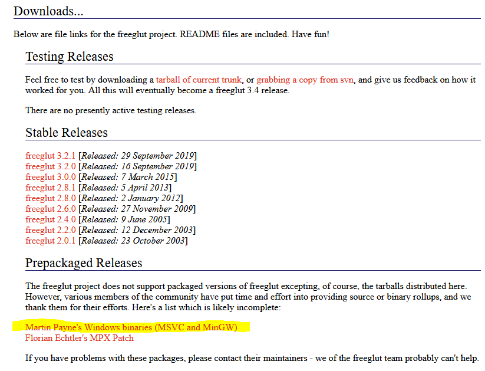
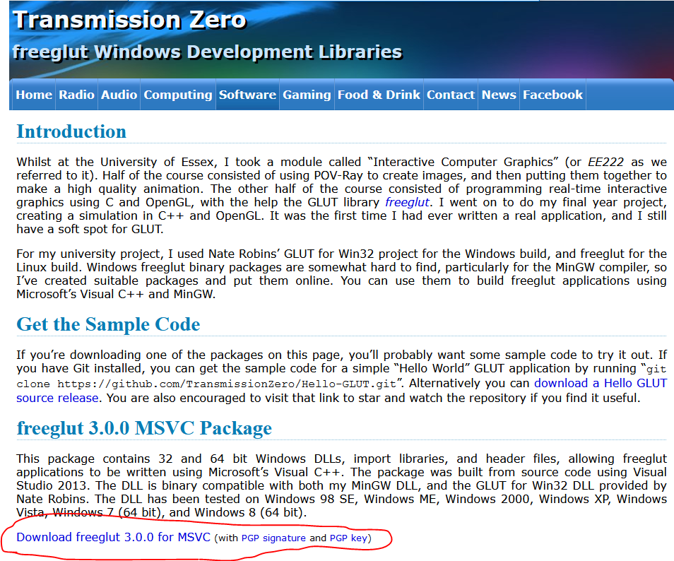
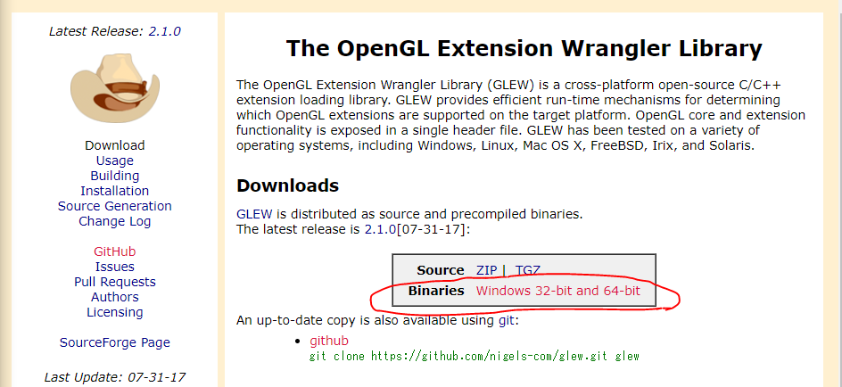
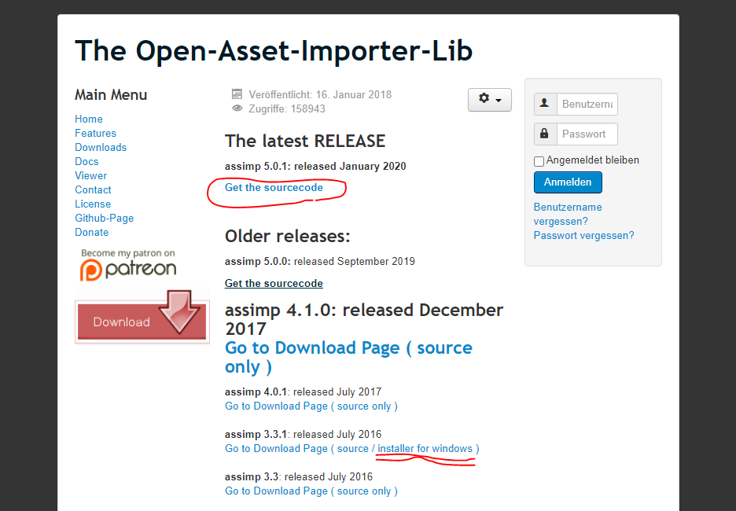
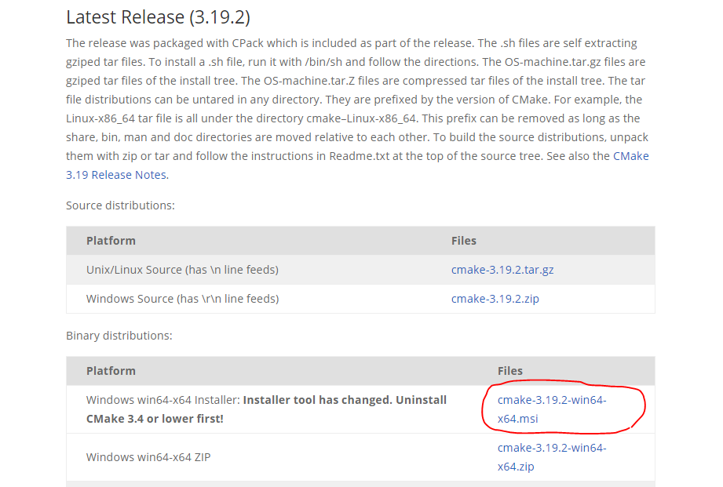
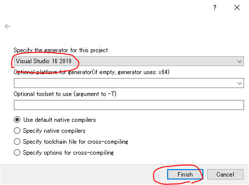
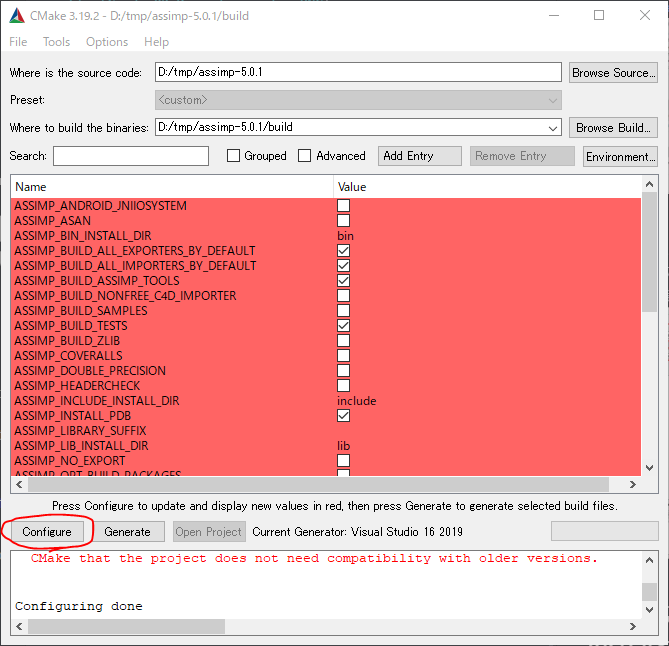
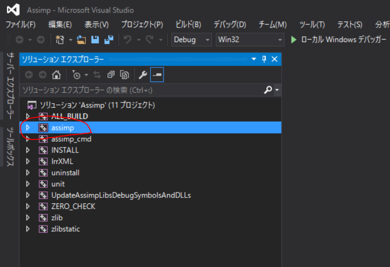

# 依存関係ライブラリのインストール (Install Dependency)

ここでは、SimpleObjectDrawingLibraryが依存しているライブラリ群のインストール方法を説明します。
一般的なインストール方法を説明しているだけなので、このような作業に慣れている方は
読み飛ばして頂いて構いません。

## fleeglut
次のページにアクセスして黄色でマークしたリンクをクリックすると
Windows用のバイナリパッケージの配布ページにジャンプします。
(ソースコードから自分でビルドしたい場合は Stable Releases の方からどうぞ。)
http://freeglut.sourceforge.net/index.php#download

ジャンプした先のページで、下図の赤で囲んだ箇所から.zipでライブラリが貰えます。

zipを展開して好きな場所に置いて下さい。

## glew
次のページにアクセスして、下図の赤で囲んだ箇所から
Windows用のバイナリパッケージをダウンロードできます。
zipを展開して好きな場所に置いて下さい。
http://glew.sourceforge.net/

## Eigen
次のページにアクセスして、下図の赤で囲んだ箇所から
Windows用のバイナリパッケージをダウンロードできます。
zipを展開して好きな場所に置いて下さい。
http://eigen.tuxfamily.org/index.php?title=Main_Page

## Assimp
次のページにアクセスして、ソースコードをダウンロードします。
http://assimp.org/index.php/downloads

2重線でマークした箇所からWindows用のインストーラも取得できますが、
何故かインストールされた C:\Program Files\Assimp\lib\ 配下のx86とx64の両方にx86用(少なくともVisualStudio2019はそう言ってエラーを吐く)のassimp.libが入っているという罠があり、x64でビルドしたい場合は結局ソースからビルドする事になります。

なので、赤線で囲んだ箇所からGitHubのリポジトリに飛んでソースを貰います。

### AssimpをソースからcmakeとVisualStudioでビルドする
cmakeというツールが必要です。cmakeをお持ちでない方はこちらから。
https://cmake.org/download/#latest

仮にassimp-5.0.1のソースコードを D:/tmp に置いたとして説明します。
cmakeを起動し、下図のようにソースコードのディレクトリとビルド用のディレクトリを指定します。

Congifgure を押すと初回のみコンパイラを選択するダイアログが開きます。

Configureが完了すると、下図のように真っ赤になって焦りますが、もう一度押すと白くなります。

その後 Generate を押すと選択したコンパイラに応じたプロジェクトファイル(VisualStudioなので.sln)が作成されます。Open Project を押すと作成されたソリューションが開きます。

作成されたソリューションの中には複数のプロジェクトが含まれていますが、assimpさえビルドすればそれでOKです。

ビルドが完了すると、
D:\tmp\assimp-5.0.1\build\code\ の Debug または Release にassimp-vcXXX-mt.dllや.libが作成されています(XXXはバージョン)。
これをわかりやすいパスに移動しておきましょう。

また、D:\work\assimp-5.0.1\build\include\assimp に生成されている config.h をコピーして D:\work\assimp-5.0.1\include\assimp の中に追加したうえで、このincludeフォルダごとわかりやすいパスに移動しておきましょう。

以上で依存関係ライブラリのインストールは完了です。

[SimpleObjectDrawingLibraryとサンプルプログラムのビルド手順 に戻る](BuildLibraryAndSamples.md)
