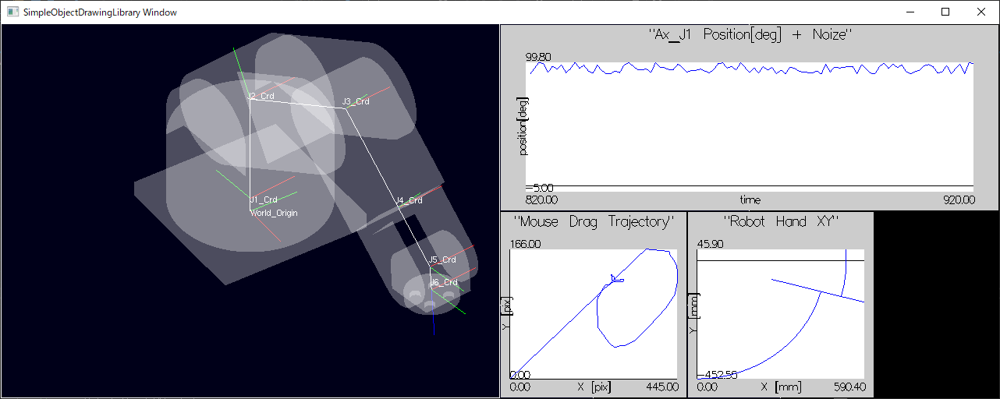

# "SimpleObjectDrawingLibrary"について

## "SimpleObjectDrawingLibrary"とは

SimpleObjectDrawingLibrary(以下、SODL)は、glut(実際にはfreeglut)のラッパーライブラリです。
SODLは、3Dモデルファイル(.stl, .objなど)や簡単な2Dグラフを
短いコードで表示(可視化)することを目的としたC++言語向けのライブラリです。

2020年末現在でとりあえず動くものが出来上がったので公開を開始しました。公開しているソースコードは.libを生成します。
.dll用のインターフェース整備の予定は今のところありません。

## ターゲットユーザ
下記の項目にandで当てはまるようなユーザを想定しています。
- C++環境で簡単に3Dモデルを描画したい
- glutやGLFWのAPIコールを呪文のように記述したくない
- ライティングやレンダリングの設定はどうでもよい
- 簡単な2Dグラフをプロットし、データを可視化したい。

例えば、ロボットアームや移動車両の制御開発をしているが、
制御対象のモデルと移動軌跡を3次元的に表示しつつ、
センサデータなどを2Dグラフに可視化するようなS/Wを
ラピッドにプロトタイプしたい場合などをターゲットとしています。

## 依存関係
SODLは依存ライブラリとして下記ライブラリに動的リンクします。
- Assimp (各種3Dモデルのローダライブラリ)
- fleeglut (glut互換の3D描画ライブラリ)
- glew (glutを拡張する3D描画ライブラリ)
- Eigen (行列計算ライブラリ ヘッダライブラリなので動的リンクでない)

## 動作環境
下記環境で開発、テストしています。
(OS依存のコードは使用していないつもりなので、他のOSでも動作すると期待しています)
- OS:Windows10 64bit
- コンパイラ:Visual Studio 2019 Community

## 機能概要
SODLが提供する機能を下記に列挙します。
- 3Dモデルファイルを読み込み、描画する機能
- いくつかのプリミティブ形状を描画する機能
- 描画対象オブジェクト間に親子関係を定義し、親の移動に子を連動させる機能
- glut相当のマウスやキーボードのコールバック関数によるインタラクション機能
