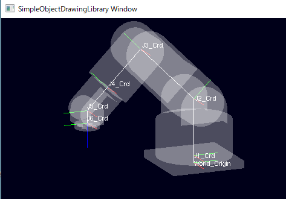

# ライブラリ機能とサンプルプログラムの説明

## sample_02_6AxRobot


### サンプルの動作説明
このサンプルは、6軸垂直多関節ロボットを模したモデルを表示し、
その各関節のモータ角度をキー入力で制御します。
キーボードの"1"\~"6"キーを押すとロボットの根本から先端の各関節角度が+方向に
"q"\~"y"キーを押すと、-方向に回転します。

#### 機能：座標系連鎖
SODLは、描画可能オブジェクト間の親子関係を定義する事ができます。
このとき、子オブジェクトの座標は、親オブジェクトの持つ座標系原点からの相対的な位置として保持されます。
そして、親オブジェクトの位置姿勢が変化した場合、ワールド座標系原点から見た子オブジェクトの位置姿勢は、
親座標系にくっついて移動しているかのように振る舞います。このような座標系同士の関係を"座標系連鎖"と呼びます。
SODLは、オブジェクトの親子関係を定義するだけで、自動的に座標系を連鎖させます。

#### 機能：ユーザ定義コールバック(キーボード)
SODLでは、glutに用意されているUI用のコールバック関数に相当するコールバック関数を使用できます。
具体的には、ユーザコード側で定義したコールバック関数をSODLの提供する描画マネージャに
関数ポインタとして渡す事で、ユーザ定義のマウスやキーボード入力に対するコールバック処理を実現できます。
本サンプルではキーボードコールバックを実装しています。

### サンプルコードの解説
サンプルコードの主な構成は、[sample_01_LoadModel](#sample_01_LoadModel)と同様です。
ここでは主に、[sample_01_LoadModel](#sample_01_LoadModel)と差分にあたる部分を説明します。

コード全体は[こちらを参照](https://github.com/HiroakiIMAI/SimpleObjectDrawingLibrary/blob/master/SODL_sample_02_6AxRobot/SODL_sample_02_6AxRobot_main.cpp)

#### 1. 初期化処理

##### 1.1. 連鎖座標系の定義
```
//-----------------------------------------------------
// ワールド座標系原点から連鎖するJ1~6座標系オブジェクトを定義
//   J1~6座標系が6軸ロボットアームの各関節の位置姿勢を表現する
//-----------------------------------------------------
// ワールド座標原点を定義
auto World_Origin = sodl::CoordChainObj::create("World_Origin");
World_Origin->CrdTrs.translation() = Eigen::Vector3f(0.f, 0.f,0.f);

// J1(Joint1)座標系オブジェクトを作成、ワールド座標系にアタッチする
auto J1_Crd = sodl::CoordChainObj::create("J1_Crd", World_Origin);
// J1座標系の親座標系に対するオフセット量を設定する
J1_Crd->CrdTrs.translation() = Eigen::Vector3f(0.f, 0.f, 30.f);

// J2座標系オブジェクトを作成、親(J1)座標系にアタッチする
auto J2_Crd = sodl::CoordChainObj::create("J2_Crd", J1_Crd );
// J2座標系の親座標系に対するオフセット量を設定する
J2_Crd->CrdTrs.translation() = Eigen::Vector3f(0.f, 0.f, 230.f);

(中略)

// J6座標系オブジェクトを作成
auto J6_Crd = sodl::CoordChainObj::create("J6_Crd", J5_Crd);
// J6座標系の親座標系に対するオフセット量を設定する
J6_Crd->CrdTrs.translation() = Eigen::Vector3f(0.f, 0.f, 50.f);

```
[sample_01_LoadModel](#sample_01_LoadModel)では1つの座標系しか定義しませんでしたが、
このサンプルではWorldOriginの他にJ1\~J6の6つの座標系を定義しています。
("J"は"Joint"(関節)に由来します。)
これらの座標系の原点が、6軸ロボットアームの各関節の回転中心の位置を表現します。
座標系の向きは、その関節の先に接続されたリンクがどのような姿勢を取るかを表現します。

垂直多関節の6軸ロボットアームは、関節とリンクが直鎖状に接続された機械構造を持ちます。
定義した座標系に直鎖状の親子関係を与えて、座標系連鎖全体でロボットアームを表現しています。

J1\~J6の座標系オブジェクトをそれぞれ定義した直後に下記のような処理があります。
```
J1_Crd->CrdTrs.translation() = Eigen::Vector3f(0.f, 0.f, 30.f);
```
これは、１つ根本側の関節から、オブジェクト自身が表す関節までのリンク長を設定するコードです。
座標系オブジェクトの`CrdTrs`というメンバはEigen::Affine3f型[1][Eigen]のオブジェクトで、
親座標系から自身までの座標変換を表現します。
メソッド `translation()`は、座標変換行列の併進成分(x,y,z移動量)への参照を返すので、
そこにリンク長を表現する(x,y,z移動量)をEigen::Vector3f型[1][Eigen]のオブジェクトとして代入しています。

[Eigen]:(#1Affine3f,Vector3fその他Eigen定義型について)
##### [1] Affine3f, Vector3f その他Eigen定義型について
Affine3fはSODLが依存する行列計算ライブラリEigenで定義された、座標変換行列を表現するクラス型です。
座標変換行列とEigen::Affine3fクラスの説明はここでは割愛します。
[Eigenの公式サイトのTransformの説明](http://eigen.tuxfamily.org/dox/classEigen_1_1Transform.html)を参照してください。AffineはTransformの4行目を定数[0,0,0,1]で固定化した特殊ケースです。

このように、SODLでは座標変換や座標系、座標値の扱いにEigenライブラリのオブジェクトを
ユーザコードに隠蔽せずに使用します。
よって、Eigenの扱いについてはある程度慣れる必要があります。
(とても有名で便利なライブラリなので、使い慣れておく価値は十分にあります。)

##### 1.2. ロボットの各リンクのモデルロードして各座標系にアタッチ
```
//-----------------------------------------------------
// 3Dモデル描画用のオブジェクトを作成する
//   6軸ロボットアームの各関節を表現する各座標系に
//   ロボットアームの各リンクの3Dモデルをアタッチする。
//-----------------------------------------------------
std::string exePath = app::GetModulePath();

// ロボット台座のモデルをロードした描画オブジェクトを生成し、ワールド座標系原点にアタッチする
auto RobotBase = sodl::CoordChain3dMdl::create(exePath + "\\3dModel\\SimpleRobot6Ax\\BasePlate.stl", "RobotBase", World_Origin);

// S1(sholder1)のモデルをロードした描画オブジェクトを生成し、J1座標系にアタッチする
auto RobotSholder1 = sodl::CoordChain3dMdl::create(exePath + "\\3dModel\\SimpleRobot6Ax\\S1.stl", "S1", J1_Crd);

// S2のモデルをロードした描画オブジェクトを生成し、J2座標系にアタッチする
auto RobotSholder2 = sodl::CoordChain3dMdl::create(exePath + "\\3dModel\\SimpleRobot6Ax\\S2.stl", "S2", J2_Crd);
// S2モデルの表示位置を調整するために、親(J2)座標系に対する座標系オフセットを設定する
RobotSholder2->CrdTrs.translation() = Eigen::Vector3f(0.f, 0.f, -90.f);

(以下略)

```
このコードは、ロボットアームの各リンクの3Dモデルを[1.1.連鎖座標系の定義](#1.1.連鎖座標系の定義)で定義したJ1\~J6座標系に貼り付けることで、関節の回転角度に応じて姿勢を変えるロボットの3Dモデルを表現しています。
モデルのロードは [sample_01_LoadModel](#sample_01_LoadModel) と特に変わりません。
各リンクの親となる座標系オブジェクトを親として指定しています。

ここでは以下の部分に注目します。
```
// S2モデルの表示位置を調整するために、親(J2)座標系に対する座標系オフセットを設定する
RobotSholder2->CrdTrs.translation() = Eigen::Vector3f(0.f, 0.f, -90.f);
```
モデリング時の3Dモデルの座標系原点から90[mm]オフセットした位置に、関節の回転中心がある3Dモデルを扱っているので、
その回転中心と座標系オブジェクトの原点(=座標系連鎖で表現したロボットモデルの関節位置)が一致するように
-90[mm]分のオフセットを与えて調整しています。

コードの実装は、 [1.1. 連鎖座標系の定義](#1.1.連鎖座標系の定義) で説明した座標系オブジェクトと同様に、
親座標系からオブジェクト自身までの座標変換(=親座標系から見た自身の位置)を設定しています。
`RobotSholder2`はロードした3Dモデルを収めた`CoordChain3dMdl型`のオブジェクトですが、
座標系オブジェクト`CoordChainObj`と同様に扱う事ができます。
なぜなら、本ライブラリにおいて、親子関係を持つ描画可能なオブジェクトは、
基本的に`CoordChainObj`から派生したクラスだからです。

#### 2. メインループ
##### 2.1. 各関節角度の更新

```
while(1)
{
  //-----------------------------------------------------
  // キー入力で更新される変数値によって、描画オブジェクトの座標変換行列を更新する
  //-----------------------------------------------------
  J1_Crd->CrdTrs.linear() = Eigen::AngleAxisf(app::ax_J1, UnitZ).matrix();
  J2_Crd->CrdTrs.linear() = Eigen::AngleAxisf(app::ax_J2, UnitX).matrix();
  J3_Crd->CrdTrs.linear() = Eigen::AngleAxisf(app::ax_J3, UnitX).matrix();
  J4_Crd->CrdTrs.linear() = Eigen::AngleAxisf(app::ax_J4, UnitZ).matrix();
  J5_Crd->CrdTrs.linear() = Eigen::AngleAxisf(app::ax_J5, UnitX).matrix();
  J6_Crd->CrdTrs.linear() = Eigen::AngleAxisf(app::ax_J6, UnitZ).matrix();

  //-----------------------------------------------------
  // 描画マネージャから描画更新を実行する
  //-----------------------------------------------------
  sodl::drwMngr->drawUpdt();

  Sleep(10);
}
```
[sample_01_LoadModel](#sample_01_LoadModel)では動かないモデルを表示するだけだったので、
`sodl::drwMngr->drawUpdt();` をコールするのみでしたが、
このサンプルでは描画を更新する度にロボットの関節角度の変化を描画に反映するための処理がメインループに入ってきます。

まず、更新処理の左辺値に注目します。
左辺には初期化処理で作成した`J1_Crd`などが再登場します。
ここで`J1_Crd`のメンバの値を変更すると、その変更が次の描画更新に自動的に反映されます。
なぜなら、`J1_Crd`はスマートポインタに収められたインスタンスであり、
描画マネージャは同じインスタンスを指すスマートポインタを得ているからです。
描画マネージャが描画対象のインスタンスへのスマートポインタを得るのは、
初期化処理の中で`sodl::drwMngr->AddObjTree_ToDrwSpace();`をコールされたときです。

左辺の更新されているメンバは`CrdTrs.linear()`です。
CrdTrsはEigen::Affin3f型の座標変換行列を表すオブジェクトで、linear()は座標変換行列の中の回転行列部分への参照を返します。よってこの式では、親座標系から見た`J1_Crd`の回転角度を更新していることになります。

次に右辺値に注目しましょう。
これは純粋なEigenライブラリのコードです。
AngleAxis()は第一引数の角度だけ、第二引数で指定した軸回りに回転させる、
3次元空間上の回転を表現するオブジェクトを返します。そのオブジェクトの.matrix()にアクセスして、
これを回転行列として表現したオブジェクトを得て、左辺に代入しています。

ここで回転角度として与えられている`app::ax_J1`には、次で説明するコールバック関数によって
ユーザキー入力を反映した値が格納されています。

#### 3. コールバック関数の定義
```
namespace app {
	//================================================================
	//
	//	<Summary>		キー操作時のコールバック
	//	<Description>
	//================================================================
	void keyFunc(unsigned char key, int u, int v)
	{
		const float		KEY_MOT_UNIT	=	5.f;
		const float		CNV_DEG2RAD		=	(M_PI / 180.f);

		switch (key) {

		case '1':
			ax_J1 += KEY_MOT_UNIT * CNV_DEG2RAD;
			break;

		case '2':
			ax_J2 += KEY_MOT_UNIT * CNV_DEG2RAD;
			break;

    (以下略)

		}
	}
```
このサンプルでは、押されたキーに応じてロボットの関節角度を表すグローバル変数`ax_J1`などを5度ずつ増減させています。
openGLで用意されているキーボードコールバックと同じ仕様の引数でコールバック関数を定義してください。


```
// ライブラリの描画マネージャを初期化する
sodl::DrawingManager::initMngr( &argc, argv, app::WINDOW_SIZE_X, app::WINDOW_SIZE_Y);

// 描画マネージャにコールバック関数を設定する
sodl::drwMngr->SetKeyboardFunc(app::keyFunc);

```

定義したコールバック関数は、描画マネージャの初期化後に、描画マネージャにSetKeySetKeyboardFunc()によって登録して下さい。
受け取った関数ポインタをライブラリ内部でopenGLの提供するコールバック登録処理にそのまま渡しています。

以上が、sample_02_6AxRobot の説明になります。


[サンプル一覧へ戻る](FunctionExplainedWithSamples.md)

[トップページへ戻る](README.md)
