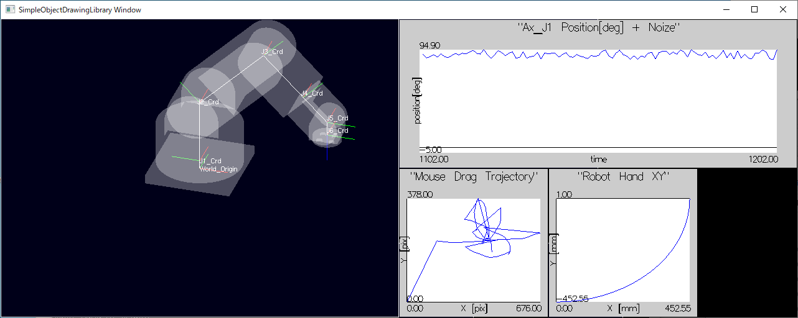

# ライブラリ機能とサンプルプログラムの説明

## sample_04_DrawGraph


### サンプルの動作説明
このサンプルでは、[sample_02_6AxRobot](#sample_02_6AxRobot)と同じロボットアームを画面左側に表示し、
画面右側には2次元グラフをプロットしています。
上のグラフはロボットの一番根本側の関節の回転角度にランダムノイズを載せた値を時系列にプロットします。
左下のグラフは、画面上をマウスでドラッグした軌跡をプロットします。
画面右下のグラフは、ワールド座標系原点から見た、ロボットハンドのXY平面上の軌跡をプロットします。

#### 機能：グラフプロット
SODLは、簡単な2Dグラフのプロット機能を提供します。
１つのグラフは、１つのビューポートとカメラを占有します。
よってこのサンプルでは、グラフを3つ描画するために3つのビューポートを追加しています。

#### 機能：複数の描画空間
[sample_03_MultiViewPort](#sample_03_MultiViewPort)では、同じオブジェクトを
複数のビューポートに別アングルから表示しましたが、
このサンプルではそれぞれのビューポートに異なるオブジェクトを描画します。
これを実現する為に、描画空間という考え方を導入します。
それぞれのビューポートに対応付けられたカメラが異なる描画空間を撮影することで、
別々のオブジェクトを描画する事ができます。
SODLは描画空間を簡単に追加する機能を提供します。

#### 機能：根本座標系(ワールド座標系)から見た子オブジェクト位置の取得
SODLは、連鎖座標系の末端(あるいは中間)に位置するオブジェクトが、
ワールド座標系原点から見た、どのような位置姿勢に存在しているかを
計算して結果を返す機能を座標系オブジェクトのメソッドとして提供します。
これにより、例えば関節角度を自由に変更した後のロボットハンドの手先位置を
メソッド呼び出しだけで取得する事ができます。

### サンプルコードの解説
サンプルコードは、ロボットを表示する部分については[sample_02_6AxRobot](#sample_02_6AxRobot)と同じです。
初期化処理でグラフ用のビューポートを設定している箇所と、
メインループでグラフのプロットデータを更新している点が差分になります。

コード全体は[こちらを参照](https://github.com/HiroakiIMAI/SimpleObjectDrawingLibrary/blob/master/SODL_sample_04_DrawGraph/SODL_sample_04_DrawGraph_main.cpp)

#### 1. 時系列グラフ
```
//----------------------------------------------------
// グラフ用に描画空間[1]を追加
//----------------------------------------------------
auto spaceGrph = sodl::drwMngr->addDrawingSpace();

//----------------------------------------------------
// ビューポート作成
//----------------------------------------------------
auto vpGrph = sodl::drwMngr->addViewPort("vpTimeSerialGraph");
vpGrph->setVpSize(
  app::WINDOW_SIZE_X / 2,		// left
  app::WINDOW_SIZE_Y / 2,		// bottom
  app::WINDOW_SIZE_X / 2,		// width
  app::WINDOW_SIZE_Y / 2		// height
);
//----------------------------------------------------
// カメラ設定
//----------------------------------------------------
auto camGrph = vpGrph->getCam();
// カメラが描画空間[1]を撮影するように関連付ける
camGrph->spaceAttached = spaceGrph;

// カメラを2Dグラフモードに設定する
//   is2DGraph = true に設定したカメラは、グラフ平面を固定的に撮影するように
//   vp->attachCam()したとき、自動的に位置姿勢が初期化される。
//   ユーザコード側でいちいちカメラの位置姿勢を設定しなくてよい。
camGrph->is2DGraphMode = true;

// ビューポートに設定を更新したカメラを関連付ける。
vpGrph->attachCam(camGrph);

//----------------------------------------------------
// 時系列グラフ(2次元)の作成と描画空間[1]への配置
//----------------------------------------------------
// 時系列グラフの作成
auto tsGrph = sodl::TimeSeriesGraph::create(
    "Ax_J1 Position[deg] + Noize",			// オブジェクト名称 = グラフタイトル
    camGrph									// 関連付けるカメラ(カメラ投影行列などの設定が済んでいること)
  );
// ラベルの設定
tsGrph->xAxisLabel->text = "time";
tsGrph->yAxisLabel->text = "position[deg]";

// 描画空間[1]にグラフを追加
sodl::drwMngr->AddObjTree_ToDrwSpace(tsGrph, 1);
```

##### 1.1 描画空間の追加
まずは時系列グラフの設定ですが、描画空間の追加に関わるコードのみ、先に見ていきましょう。
```
auto spaceGrph = sodl::drwMngr->addDrawingSpace();
```
そして、追加した空間を撮影するようにカメラに設定してるコードがこちらです。
```
camGrph->spaceAttached = spaceGrph;
```
追加した描画空間に描画対象オブジェクトを配置しているコードが最後の部分です。
この第二引数に与えられた`1`が、最初に追加した描画空間に対応するindexになっています。
デフォルトの描画空間にオブジェクトを配置する場合は、第二引数を省略するか0を明示的に与えます。
追加した描画空間にオブジェクトを配置する場合は、描画空間を追加した順に割り振られるindexを第二引数に与えます。
```
sodl::drwMngr->AddObjTree_ToDrwSpace(tsGrph, 1);
```
描画空間に関わるコードはこれだけです。

##### 1.2 グラフオブジェクトの生成
次に、描画対象であるグラフオブジェクトの生成を見ていきましょう。
```
// 時系列グラフの作成
auto tsGrph = sodl::TimeSeriesGraph::create(
    "Ax_J1 Position[deg] + Noize",			// オブジェクト名称 = グラフタイトル
    camGrph									// 関連付けるカメラ(カメラ投影行列などの設定が済んでいること)
  );
// ラベルの設定
tsGrph->xAxisLabel->text = "time";
tsGrph->yAxisLabel->text = "position[deg]";
```
第一引数で与えるオブジェクトの名称はそのままグラフタイトルに表示されます。
また、グラフを撮影するカメラを初期化時に登録します。
内部の処理の都合上、カメラの撮影領域にグラフのサイズを合わせるために必要としています。
このあとにカメラの設定を変更すると、グラフが見切れたりするので注意が必要です。
グラフオブジェクトは他の描画可能オブジェクトと異なり、
`create()`のときに親座標系オブジェクトを指定できません。
考え方として、グラフオブジェクトは1つの描画空間に単独で存在し、
カメラもそのグラフだけを撮影するものなので、親を持つ必要がないからです。

グラフの軸ラベルはグラフオブジェクトのメンバになっています。
グラフの内容に合わせて任意の文字列を代入できます。

##### 1.3 メインループでのプロットデータの更新
このサンプルでは、プロットデータを動的に変化させるため、
メインループ内でプロットデータの更新処理を実施します。

```
while(1)
{
  (前略)

	//-----------------------------------------------------
	// J1関節角度＋ランダムノイズを時系列グラフにプロット
	//-----------------------------------------------------
	timeSerialGraph->addData(Eigen::Vector3f(count, app::ax_J1*180.0/M_PI + ((rand()%100 - 50)/10.0), 0));

  (後略)

  //-----------------------------------------------------
	// 描画マネージャから描画更新を実行する
	//-----------------------------------------------------
	sodl::drwMngr->drawUpdt();

	++count;
	Sleep(10);
}
```
`timeSerialGraph`は初期化処理の`tsGrph`と同じインスタンスを指しています。
グラフオブジェクトの`addData()`メソッドを呼び出すことで、
Eigen::Vector3f型の3次元空間上の点をプロットデータに追加する事ができます。
2次元グラフなのでz軸の値は無効ですが、負の値や極端に大きい値を設定すると、
背景の後ろに隠れたり、カメラよりも手前に位置して描画されなかったりするので
注意が必要です。
無限にaddData()していくとメモリを食い潰すので、最大データ数を超えた時点で
一番古いデータから順に破棄していきます。
最大データ数は、グラフオブジェクトのメンバ変数`dataNumMax`で設定でき、
デフォルト値は1000です。

時系列グラフの説明は以上です。

#### 2. 散布図グラフ
```
//----------------------------------------------------
// 散布図グラフ(2次元)の作成と描画空間[2]への配置
//----------------------------------------------------
// 散布図グラフの作成
auto scttrGrph = sodl::GraphObj::create(
  "Mouse Drag Trajectory",				// オブジェクト名称 = グラフタイトル
  camGrph									// 関連付けるカメラ(カメラ投影行列などの設定が済んでいること)
);
// ラベルの設定
scttrGrph->xAxisLabel->text = "X [pix]";
scttrGrph->yAxisLabel->text = "Y [pix]";
// 描画空間[2]にグラフを追加
sodl::drwMngr->AddObjTree_ToDrwSpace(scttrGrph, 2);
```
散布図グラフの作成手順も時系列グラフと同じです。
ビューポートとカメラの追加はコードの引用も省略しています。
差分は、グラフのインスタンスが`TimeSeriesGraph`であるか、`GraphObj`であるか、です。
`TimeSeriesGraph`はデフォルトで古いデータが左に流れて見えなくなるようなプロット範囲をとるのに対し、
散布図で用いている`GraphObj`は、デフォルトで古いデータがいつまでも流れないようなプロット範囲を維持します。だだし、古いデータ自体はやはりメモリの問題でサンプル数が`dataNumMax`を超えると削除されます。

以降は、プロットデータを作成している箇所を見ていきます。
2つの散布図はマウスドラッグ軌跡とロボットの手先の軌跡をそれぞれブロットしています。

##### 2.1 マウスドラッグ軌跡のプロット
```
while(1)
{

  (略)

  //-----------------------------------------------------
  // ドラッグ中のマウス位置X,Yを散布図グラフにプロット
  //-----------------------------------------------------
  scatterGraph_mouseDrag->addData(Eigen::Vector3f(app::mouse_x, app::mouse_y, 0));

  //-----------------------------------------------------
  // 描画マネージャから描画更新を実行する
  //-----------------------------------------------------
  sodl::drwMngr->drawUpdt();

  ++count;
  Sleep(10);
}

```
メインループでは、単に`app::mouse_x`, `app::mouse_y` をプロットに加えているだけです。
これらの変数はグローバル変数で、マウスコールバック関数で更新されています。
コールバック関数を以下に示します。
```
namespace app {
  //================================================================
  //
  //	<Summary>		GLウィンドウ上でマウスドラッグ時のコールバック
  //	<Description>
  //================================================================
  void onMouseDrag(int u, int v)
  {
  	mouse_x = u;
  	mouse_y = WINDOW_SIZE_Y - v;
  }
}
```
いたってシンプルです。
コールバックで得られる値がWindowsのウィンドウ座標系準拠なので
画面左上原点の下方向が(+)の座標値となります。
一方、グラフプロットの座標系は左下原点の上方向が(+)の座標系としたかったので
反転してウィンドウサイズから減算した値を`mouse_y`に代入しています。

他に、マウスボタンを押したときのコールバック関数`onMouseBtn()`と
ボタンを押さずにウィンドウ上をにマウスを乗せて移動させたときのコールバック関数
`onMouseHover()`が何もしない関数として実装されています。

##### 2.2 ロボットの手先軌跡のプロット
```
while(1)
{
  (略)

  //-----------------------------------------------------
  // ロボットハンド位置X,Yを散布図グラフにプロット
  //-----------------------------------------------------
  Eigen::Vector3f handPos = J6_Crd->GetTf_root2self().translation();
  scatterGraph_RobotHandXY->addData( handPos );

  (略)

  //-----------------------------------------------------
  // 描画マネージャから描画更新を実行する
  //-----------------------------------------------------
  sodl::drwMngr->drawUpdt();

  ++count;
  Sleep(10);
}
```
ロボットハンドの手先座標の計算は、メイン関数の中で実装しています。
`Eigen::Vector3f handPos = J6_Crd->GetTf_root2self().translation();`
の一行です。
`J6_Crd`はロボットの手先を表現している座標系オブジェクト(`CoordChainObj`のインスタンス)です。
そして、座標系オブジェクトクラス`CoordChainObj`のメソッドである`GetTf_root2self()`は、
座標系連鎖を親の親の・・・と辿って、
根本までたどり着いた座標系オブジェクトから見た、自分自身までの座標変換
(言い換えると、自分自身の位置姿勢)を表す`Eigen::Affine3f`オブジェクトを返します。
`Eigen::Affine3f`から位置情報だけを取り出す`translation()`をコールして得られた
`Eigen::Vector3f`がワールド座標原点から見たロボットハンドの手先位置として`handPos`
に代入されます。

`CoordChainObj::GetTf_root2self()`は使いこなすと強力な座標変換ツールになります。
また`Eigen::Affine3f`の扱いを理解することは、それ以上に座標変換の実装を楽にしてくれます。

sample_04_DrawGraph の説明は以上です。

[サンプル一覧へ戻る](FunctionExplainedWithSamples.md)

[トップページへ戻る](README.md)
